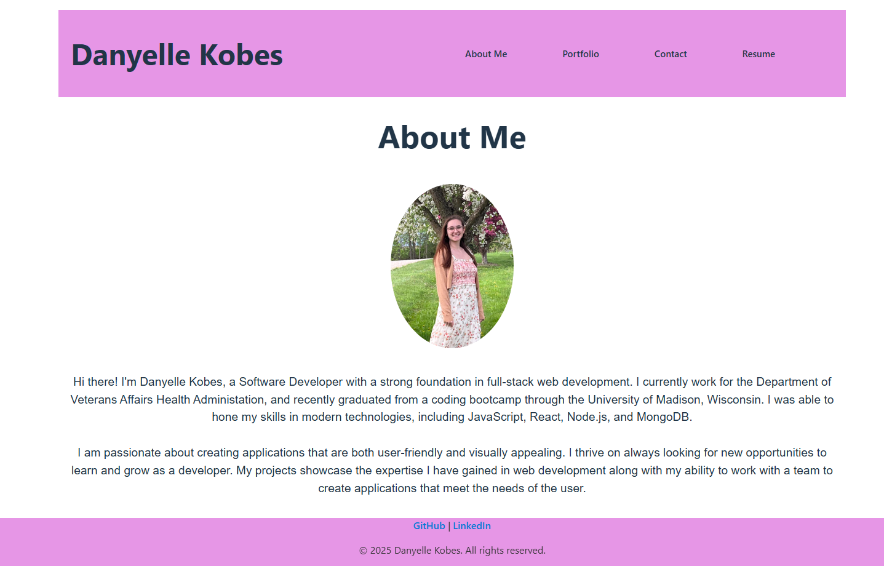

# Portfolio

# Table of Contents 
1. [Description] (#description)
2. [Installation] (#installation)
3. [Usage] (#usage)
4. [Collaborators] (#collaborators)
5. [Contact] (#contact)

## Description
This is my personal portfolio for work reference. This will allow users to look through my resume, projects I've worked on, and knowledge at ease.

## Installation
Just click on this link and you'll go to the site!
https://danyellekportfolio.netlify.app/

## Usage
Use at your pace to look through my credentials!

## Collaborators
Looked at other portfolios for color design ideas

## Contact
email: dkobes15@gmail.com
GitHub: https://github.com/Dkobes
